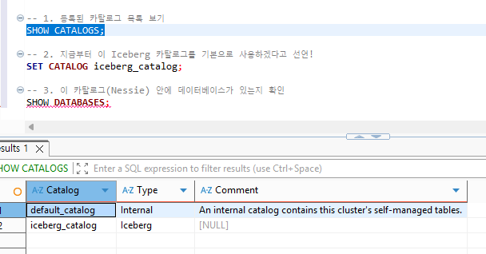
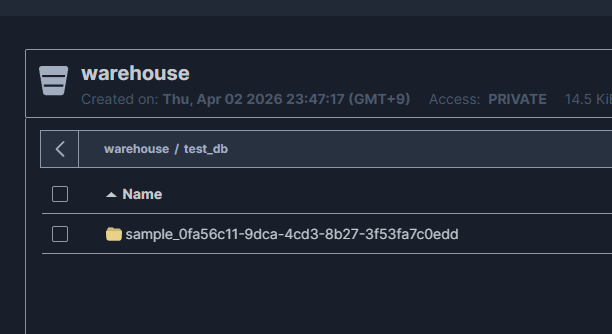

# srt
starrocks 테스트

##  datalake 구축

```

cd datalake
docker-compose up -d

 docker ps -a
CONTAINER ID   IMAGE                         COMMAND                  CREATED          STATUS                    PORTS                                                                                                                                   NAMES
86a099eb4a18   starrocks/be-ubuntu:latest    "/opt/starrocks/be/b…"   39 minutes ago   Up 39 minutes             0.0.0.0:8040->8040/tcp, [::]:8040->8040/tcp, 0.0.0.0:9050->9050/tcp, [::]:9050->9050/tcp                                                starrocks-be
a4ac83d8bee6   apache/kudu:latest            "/kudu-entrypoint.sh…"   39 minutes ago   Up 39 minutes             0.0.0.0:7051->7051/tcp, [::]:7051->7051/tcp, 0.0.0.0:8051->8051/tcp, [::]:8051->8051/tcp                                                kudu-tserver
e0a0a783717d   projectnessie/nessie:latest   "/usr/local/s2i/run"     39 minutes ago   Up 39 minutes             8080/tcp, 8443/tcp, 0.0.0.0:19120->19120/tcp, [::]:19120->19120/tcp                                                                     nessie
060e82c39d6c   starrocks/fe-ubuntu:latest    "/opt/starrocks/fe/b…"   39 minutes ago   Up 39 minutes             0.0.0.0:8030->8030/tcp, [::]:8030->8030/tcp, 0.0.0.0:9020->9020/tcp, [::]:9020->9020/tcp, 0.0.0.0:9030->9030/tcp, [::]:9030->9030/tcp   starrocks-fe
1961862e32e1   apache/spark:3.5.0            "/opt/spark/bin/spar…"   39 minutes ago   Up 39 minutes             0.0.0.0:7077->7077/tcp, [::]:7077->7077/tcp, 0.0.0.0:8080->8080/tcp, [::]:8080->8080/tcp                                                spark
667405dabe39   apache/kudu:latest            "/kudu-entrypoint.sh…"   39 minutes ago   Up 39 minutes             0.0.0.0:7050->7050/tcp, [::]:7050->7050/tcp, 0.0.0.0:8050->8050/tcp, [::]:8050->8050/tcp                                                kudu-master
b186d2a90c61   minio/minio:latest            "/usr/bin/docker-ent…"   39 minutes ago   Up 39 minutes (healthy)   0.0.0.0:9000-9001->9000-9001/tcp, [::]:9000-9001->9000-9001/tcp 

```


## 접속 정보


## 셋업

디비 베어 접속후

```
ALTER SYSTEM ADD BACKEND "starrocks-be:9050";
SHOW BACKENDS;


CREATE DATABASE IF NOT EXISTS herb24;

USE herb24;


CREATE TABLE detection_logs (
    detect_id VARCHAR(50),
    user_id INT,
    herb_name VARCHAR(50),
    confidence DOUBLE,
    latitude DOUBLE,
    longitude DOUBLE,
    device_os VARCHAR(20),
    detect_time DATETIME
)
DISTRIBUTED BY HASH(detect_id) BUCKETS 3
PROPERTIES(
    "replication_num" = "1"
);
```

## 실행
1. dataGenerator.py 실행
2. uploadData_StarrocksStreamLoadApi.py 실행  10만건의 데이터가 starrocks 에 저장됨


## Spark - Starrocks 데이터 적재
```
(venv) oracle@DESKTOP-GLHA97V:~/project/project_f/mvp/starrocks_test/srt/App$ python load_data_with_spark.py 
🚀 1. Spark Session 초기화 및 StarRocks 커넥터 다운로드 중...
26/04/02 23:14:42 WARN Utils: Your hostname, DESKTOP-GLHA97V resolves to a loopback address: 127.0.1.1; using 10.255.255.254 instead (on interface lo)
26/04/02 23:14:42 WARN Utils: Set SPARK_LOCAL_IP if you need to bind to another address
:: loading settings :: url = jar:file:/mnt/f/project/mvp/starrocks_test/srt/venv/lib/python3.10/site-packages/pyspark/jars/ivy-2.5.1.jar!/org/apache/ivy/core/settings/ivysettings.xml
Ivy Default Cache set to: /home/oracle/.ivy2/cache
The jars for the packages stored in: /home/oracle/.ivy2/jars
com.starrocks#starrocks-spark-connector-3.5_2.12 added as a dependency
mysql#mysql-connector-java added as a dependency
:: resolving dependencies :: org.apache.spark#spark-submit-parent-10944287-e501-4842-a501-f0289c9aa580;1.0
        confs: [default]
        found com.starrocks#starrocks-spark-connector-3.5_2.12;1.1.2 in central
mysql#mysql-connector-java;8.0.33 is relocated to com.mysql#mysql-connector-j;8.0.33. Please update your dependencies.
        found mysql#mysql-connector-java;8.0.33 in central
        found com.mysql#mysql-connector-j;8.0.33 in central
        found com.google.protobuf#protobuf-java;3.21.9 in central
downloading https://repo1.maven.org/maven2/com/mysql/mysql-connector-j/8.0.33/mysql-connector-j-8.0.33.jar ...
        [SUCCESSFUL ] com.mysql#mysql-connector-j;8.0.33!mysql-connector-j.jar (129ms)
downloading https://repo1.maven.org/maven2/com/google/protobuf/protobuf-java/3.21.9/protobuf-java-3.21.9.jar ...
        [SUCCESSFUL ] com.google.protobuf#protobuf-java;3.21.9!protobuf-java.jar(bundle) (105ms)
:: resolution report :: resolve 1793ms :: artifacts dl 238ms
        :: modules in use:
        com.google.protobuf#protobuf-java;3.21.9 from central in [default]
        com.mysql#mysql-connector-j;8.0.33 from central in [default]
        com.starrocks#starrocks-spark-connector-3.5_2.12;1.1.2 from central in [default]
        mysql#mysql-connector-java;8.0.33 from central in [default]
        ---------------------------------------------------------------------
        |                  |            modules            ||   artifacts   |
        |       conf       | number| search|dwnlded|evicted|| number|dwnlded|
        ---------------------------------------------------------------------
        |      default     |   4   |   3   |   3   |   0   ||   3   |   2   |
        ---------------------------------------------------------------------
:: retrieving :: org.apache.spark#spark-submit-parent-10944287-e501-4842-a501-f0289c9aa580
        confs: [default]
        2 artifacts copied, 1 already retrieved (4055kB/12ms)
26/04/02 23:14:45 WARN NativeCodeLoader: Unable to load native-hadoop library for your platform... using builtin-java classes where applicable
Setting default log level to "WARN".
To adjust logging level use sc.setLogLevel(newLevel). For SparkR, use setLogLevel(newLevel).
📦 2. CSV 데이터 읽어오기: /mnt/f/project/mvp/starrocks_test/srt/herb24_100k_data.csv
root
 |-- detect_id: string (nullable = true)
 |-- user_id: integer (nullable = true)
 |-- herb_name: string (nullable = true)
 |-- confidence: double (nullable = true)
 |-- latitude: double (nullable = true)
 |-- longitude: double (nullable = true)
 |-- device_os: string (nullable = true)
 |-- detect_time: timestamp (nullable = true)

⚡ 3. StarRocks로 병렬 분산 적재 시작...
✅ Spark를 통한 StarRocks 대용량 적재 완료!
(venv) oracle@DESKTOP-GLHA97V:~/project/project_f/mvp/starrocks_test/srt/App$ 
```


## iceberg catalog 구축

## nessie 수정
```
  nessie:
    image: ghcr.io/projectnessie/nessie:latest
    container_name: nessie
    ports: ["19120:19120"]
    networks: [datalake-network]
    depends_on:
      minio: { condition: service_healthy }
    environment:
      - nessie.catalog.default-warehouse=warehouse
      - nessie.catalog.warehouses.warehouse.location=s3://warehouse/
      - nessie.catalog.service.s3.default-options.endpoint=http://minio:9000/
      - nessie.catalog.service.s3.default-options.path-style-access=true
      - nessie.catalog.service.s3.default-options.region=us-east-1
      - nessie.catalog.service.s3.default-options.auth-type=STATIC
      - nessie.catalog.service.s3.default-options.access-key=urn:nessie-secret:quarkus:nessie.catalog.secrets.access-key
      - nessie.catalog.secrets.access-key.name=minioadmin
      - nessie.catalog.secrets.access-key.secret=minioadmin
      - nessie.server.authentication.enabled=false
```

-- docker container 재시작
```
docker compose up -d --force-recreate nessie
## 확인
curl -v http://localhost:19120/iceberg/v1/config
* Host localhost:19120 was resolved.
* IPv6: ::1
* IPv4: 127.0.0.1
*   Trying [::1]:19120...
* Connected to localhost (::1) port 19120
> GET /iceberg/v1/config HTTP/1.1
> Host: localhost:19120
> User-Agent: curl/8.5.0
> Accept: */*
>
< HTTP/1.1 200 OK
< content-length: 1728
< Content-Type: application/json;charset=UTF-8
<
{
  "defaults" : {
    "rest-metrics-reporting-enabled" : "false",
    "warehouse" : "s3://warehouse",
    "rest-page-size" : "200",
    "prefix" : "main"
  },
  "overrides" : {
    "nessie.core-base-uri" : "http://localhost:19120/api/",
    "nessie.catalog-base-uri" : "http://localhost:19120/catalog/v1/",
    "nessie.iceberg-base-uri" : "http://localhost:19120/iceberg/",
    "uri" : "http://localhost:19120/iceberg/",
    "nessie.is-nessie-catalog" : "true",
    "nessie.prefix-pattern" : "{ref}|{warehouse}",
    "nessie.default-branch.name" : "main"
  },
  "endpoints" : [ "GET /v1/{prefix}/namespaces", "GET /v1/{prefix}/namespaces/{namespace}", "HEAD /v1/{prefix}/namespaces/{namespace}", "POST /v1/{prefix}/namespaces", "POST /v1/{prefix}/namespaces/{namespace}/properties", "DELETE /v1/{prefix}/namespaces/{namespace}", "POST /v1/{prefix}/transactions/commit", "GET /v1/{prefix}/namespaces/{namespace}/tables", "GET /v1/{prefix}/namespaces/{namespace}/tables/{table}", "HEAD /v1/{prefix}/namespaces/{namespace}/tables/{table}", "POST /v1/{prefix}/namespaces/{namespace}/tables", "POST /v1/{prefix}/namespaces/{namespace}/tables/{table}", "DELETE /v1/{prefix}/namespaces/{namespace}/tables/{table}", "POST /v1/{prefix}/tables/rename", "POST /v1/{prefix}/namespaces/{namespace}/register", "POST /v1/{prefix}/namespaces/{namespace}/tables/{table}/metrics", "GET /v1/{prefix}/namespaces/{namespace}/views", "GET /v1/{prefix}/namespaces/{namespace}/views/{view}", "HEAD /v1/{prefix}/namespaces/{namespace}/views/{view}", "POST /v1/{prefix}/namespaces/{namespace}/views", "POST /v1/{prefix}/namespaces/{namespace}/views/{view}", "DELETE /v1/{prefix}/namespaces/{namespace}/views/{view}", "POST /v1/{prefix}/views/rename" ]
* Connection #0 to host localhost left intact
```

1. minio bucket 생성

2. starrocks -> iceberg catalog 연결
```

-- 1. 고장 난 카탈로그 버리기
DROP CATALOG IF EXISTS iceberg_catalog;

-- 2. 새로운 API 주소로 다시 만들기
CREATE EXTERNAL CATALOG iceberg_catalog
PROPERTIES (
    "type" = "iceberg",
    "iceberg.catalog.type" = "rest",
    -- ✨ 핵심 변경: API 경로를 /api/v1/iceberg/ 로 변경!
    "iceberg.catalog.uri" = "http://nessie:19120/iceberg/", 
    "iceberg.catalog.warehouse" = "s3://warehouse/",
    
    "aws.s3.endpoint" = "http://minio:9000",
    "aws.s3.access_key" = "minioadmin",
    "aws.s3.secret_key" = "minioadmin",
    "aws.s3.enable_path_style_access" = "true"
);


```


```

-- 1. 등록된 카탈로그 목록 보기
SHOW CATALOGS;

-- 2. 지금부터 이 Iceberg 카탈로그를 기본으로 사용하겠다고 선언!
SET CATALOG iceberg_catalog;

-- 3. 이 카탈로그(Nessie) 안에 데이터베이스가 있는지 확인
SHOW DATABASES;
```

-- ice berg 데이터 적재 확인
```commandline

CREATE DATABASE iceberg_catalog.test_db;
USE iceberg_catalog.test_db;

CREATE TABLE sample (
    id INT,
    name STRING,
    created_at DATETIME
);

INSERT INTO sample VALUES (1, 'hello', now());

INSERT INTO sample VALUES 
(2, 'test2', now()),
(3, 'test3', now()),
(4, 'test4', now()),
(5, 'test5', now());


SELECT * FROM sample;

```


-- minio 확인




## IceBerg Spark 등록

```commandline
 echo "127.0.0.1 minio" | sudo tee -a /etc/hosts
[sudo] password for oracle:
127.0.0.1 minio
(venv) oracle@DESKTOP-GLHA97V:~/project/project_f/mvp/starrocks_test/srt$ python App/load_data_with_spark_iceberg.py
🚀 1. Spark Session 초기화 (Iceberg + Nessie REST Catalog)...
26/04/03 23:21:06 WARN Utils: Your hostname, DESKTOP-GLHA97V resolves to a loopback address: 127.0.1.1; using 10.255.255.254 instead (on interface lo)
26/04/03 23:21:06 WARN Utils: Set SPARK_LOCAL_IP if you need to bind to another address
:: loading settings :: url = jar:file:/mnt/f/project/mvp/starrocks_test/srt/venv/lib/python3.10/site-packages/pyspark/jars/ivy-2.5.1.jar!/org/apache/ivy/core/settings/ivysettings.xml
Ivy Default Cache set to: /home/oracle/.ivy2/cache
The jars for the packages stored in: /home/oracle/.ivy2/jars
org.apache.iceberg#iceberg-spark-runtime-3.5_2.12 added as a dependency
org.apache.iceberg#iceberg-aws-bundle added as a dependency
:: resolving dependencies :: org.apache.spark#spark-submit-parent-d27384d4-88e5-492d-aeb4-3a1a726c82fc;1.0
        confs: [default]
        found org.apache.iceberg#iceberg-spark-runtime-3.5_2.12;1.5.0 in central
        found org.apache.iceberg#iceberg-aws-bundle;1.5.0 in central
:: resolution report :: resolve 102ms :: artifacts dl 3ms
        :: modules in use:
        org.apache.iceberg#iceberg-aws-bundle;1.5.0 from central in [default]
        org.apache.iceberg#iceberg-spark-runtime-3.5_2.12;1.5.0 from central in [default]
        ---------------------------------------------------------------------
        |                  |            modules            ||   artifacts   |
        |       conf       | number| search|dwnlded|evicted|| number|dwnlded|
        ---------------------------------------------------------------------
        |      default     |   2   |   0   |   0   |   0   ||   2   |   0   |
        ---------------------------------------------------------------------
:: retrieving :: org.apache.spark#spark-submit-parent-d27384d4-88e5-492d-aeb4-3a1a726c82fc
        confs: [default]
        0 artifacts copied, 2 already retrieved (0kB/4ms)
26/04/03 23:21:07 WARN NativeCodeLoader: Unable to load native-hadoop library for your platform... using builtin-java classes where applicable
Setting default log level to "WARN".
To adjust logging level use sc.setLogLevel(newLevel). For SparkR, use setLogLevel(newLevel).
📦 2. CSV 데이터 읽어오기: /mnt/f/project/mvp/starrocks_test/srt/herb24_100k_data.csv
root
 |-- detect_id: string (nullable = true)
 |-- user_id: integer (nullable = true)
 |-- herb_name: string (nullable = true)
 |-- confidence: double (nullable = true)
 |-- latitude: double (nullable = true)
 |-- longitude: double (nullable = true)
 |-- device_os: string (nullable = true)
 |-- detect_time: timestamp (nullable = true)

총 100000 건 로드됨
⚡ 3. Nessie Iceberg 테이블로 적재 시작...
✅ 4. 적재 검증...
+------+
| total|
+------+
|100000|
+------+

+------------------------------------+-------+---------+----------+---------+----------+---------+-------------------+
|detect_id                           |user_id|herb_name|confidence|latitude |longitude |device_os|detect_time        |
+------------------------------------+-------+---------+----------+---------+----------+---------+-------------------+
|c1a092af-e3ce-4f72-ba93-c5609a14af8d|1017   |도라지   |0.9402    |37.062741|127.671424|Android  |2025-07-20 22:11:02|
|5d16ab5c-d272-4afb-a4e3-677e74d943a6|1581   |인삼     |0.8118    |33.814962|128.111552|Android  |2025-10-17 05:58:31|
|371c68a8-ce61-4124-b9ce-0712456fb404|9984   |천남성   |0.6735    |36.805186|130.711549|Android  |2025-05-27 05:38:15|
|c7349ef4-e139-4d09-887b-8f4e07994018|8667   |하수오   |0.893     |35.071697|127.554925|Android  |2025-03-28 20:36:00|
|451f3141-8778-42dd-b00b-755ff0c9c63c|5922   |천마     |0.588     |36.608199|127.756525|Android  |2025-07-02 16:08:33|
+------------------------------------+-------+---------+----------+---------+----------+---------+-------------------+

🎉 Iceberg 적재 완료! StarRocks에서 조회 가능:
  SELECT * FROM iceberg_catalog.test_db.detection_logs LIMIT 10;
(venv) oracle@DESKTOP-GLHA97V:~/project/project_f/mvp/starrocks_test/srt$
```

-- dbBear 에서 확인
```commandline
SHOW DATABASES

use test_db

show tables

select * from detection_logs
```


## spark-connect

```commandline
(venv_win) PS F:\project\mvp\starrocks_test\srt> pip install --index-url https://pypi.org/simple pandas pyarrow "pyspark[connect]==3.5.0"
Collecting pandas
  Downloading pandas-2.3.3-cp310-cp310-win_amd64.whl.metadata (19 kB)
Collecting pyarrow
  Downloading pyarrow-23.0.1-cp310-cp310-win_amd64.whl.metadata (3.1 kB)
Requirement already satisfied: pyspark==3.5.0 in .\venv_win\lib\site-packages (from pyspark[connect]==3.5.0) (3.5.0)
Requirement already satisfied: py4j==0.10.9.7 in .\venv_win\lib\site-packages (from pyspark==3.5.0->pyspark[connect]==3.5.0) (0.10.9.7)
Collecting grpcio>=1.56.0 (from pyspark[connect]==3.5.0)
  Downloading grpcio-1.80.0-cp310-cp310-win_amd64.whl.metadata (3.9 kB)
Collecting grpcio-status>=1.56.0 (from pyspark[connect]==3.5.0)
  Downloading grpcio_status-1.80.0-py3-none-any.whl.metadata (1.3 kB)
Collecting googleapis-common-protos>=1.56.4 (from pyspark[connect]==3.5.0)
  Downloading googleapis_common_protos-1.74.0-py3-none-any.whl.metadata (9.2 kB)
Collecting numpy>=1.15 (from pyspark[connect]==3.5.0)
  Downloading numpy-2.2.6-cp310-cp310-win_amd64.whl.metadata (60 kB)
Collecting python-dateutil>=2.8.2 (from pandas)
  Using cached python_dateutil-2.9.0.post0-py2.py3-none-any.whl.metadata (8.4 kB)
Collecting pytz>=2020.1 (from pandas)
  Downloading pytz-2026.1.post1-py2.py3-none-any.whl.metadata (22 kB)
Collecting tzdata>=2022.7 (from pandas)
  Downloading tzdata-2026.1-py2.py3-none-any.whl.metadata (1.4 kB)
Collecting protobuf<8.0.0,>=4.25.8 (from googleapis-common-protos>=1.56.4->pyspark[connect]==3.5.0)
  Downloading protobuf-7.34.1-cp310-abi3-win_amd64.whl.metadata (595 bytes)
Collecting typing-extensions~=4.12 (from grpcio>=1.56.0->pyspark[connect]==3.5.0)
  Using cached typing_extensions-4.15.0-py3-none-any.whl.metadata (3.3 kB)
Collecting protobuf<8.0.0,>=4.25.8 (from googleapis-common-protos>=1.56.4->pyspark[connect]==3.5.0)
  Downloading protobuf-6.33.6-cp310-abi3-win_amd64.whl.metadata (593 bytes)
Collecting six>=1.5 (from python-dateutil>=2.8.2->pandas)
  Using cached six-1.17.0-py2.py3-none-any.whl.metadata (1.7 kB)
Downloading pandas-2.3.3-cp310-cp310-win_amd64.whl (11.3 MB)
   ━━━━━━━━━━━━━━━━━━━━━━━━━━━━━━━━━━━━━━━━ 11.3/11.3 MB 64.4 MB/s  0:00:00
Downloading pyarrow-23.0.1-cp310-cp310-win_amd64.whl (27.5 MB)
   ━━━━━━━━━━━━━━━━━━━━━━━━━━━━━━━━━━━━━━━━ 27.5/27.5 MB 41.6 MB/s  0:00:00
Downloading googleapis_common_protos-1.74.0-py3-none-any.whl (300 kB)
Downloading grpcio-1.80.0-cp310-cp310-win_amd64.whl (4.9 MB)
   ━━━━━━━━━━━━━━━━━━━━━━━━━━━━━━━━━━━━━━━━ 4.9/4.9 MB 59.3 MB/s  0:00:00
Using cached typing_extensions-4.15.0-py3-none-any.whl (44 kB)
Downloading grpcio_status-1.80.0-py3-none-any.whl (14 kB)
Downloading protobuf-6.33.6-cp310-abi3-win_amd64.whl (437 kB)
Downloading numpy-2.2.6-cp310-cp310-win_amd64.whl (12.9 MB)
   ━━━━━━━━━━━━━━━━━━━━━━━━━━━━━━━━━━━━━━━━ 12.9/12.9 MB 15.0 MB/s  0:00:00
Using cached python_dateutil-2.9.0.post0-py2.py3-none-any.whl (229 kB)
Downloading pytz-2026.1.post1-py2.py3-none-any.whl (510 kB)
Using cached six-1.17.0-py2.py3-none-any.whl (11 kB)
Downloading tzdata-2026.1-py2.py3-none-any.whl (348 kB)
Installing collected packages: pytz, tzdata, typing-extensions, six, pyarrow, protobuf, numpy, python-dateutil, grpcio, googleapis-common-protos, pandas, grpcio-status
Successfully installed googleapis-common-protos-1.74.0 grpcio-1.80.0 grpcio-status-1.80.0 numpy-2.2.6 pandas-2.3.3 protobuf-6.33.6 pyarrow-23.0.1 python-dateutil-2.9.0.post0 pytz-2026.1.post1 six-1.17.0 typing-extensions-4.15.0 tzdata-2026.1
(venv_win) PS F:\project\mvp\starrocks_test\srt> 
```


```commandline
(venv) oracle@DESKTOP-GLHA97V:~/project/project_f/mvp/starrocks_test/srt$ python App/load_to_iceberg_connect.py
🌐 1. Spark Connect Server 연결 중 (sc://localhost:15002)...
🐼 2. Pandas로 데이터 읽기: herb24_100k_data.csv
🚀 3. Pandas DF -> Spark DF 변환 및 전송 (건수: 100000)
⚡ 4. Iceberg 테이블 적재 시작 (nessie.test_db.detection_logs)...
✅ 5. 적재 데이터 검증 (Spark SQL)
+------+
| total|
+------+
|100000|
+------+

+------------------------------------+-------+---------+----------+---------+----------+---------+-------------------+
|detect_id                           |user_id|herb_name|confidence|latitude |longitude |device_os|detect_time        |
+------------------------------------+-------+---------+----------+---------+----------+---------+-------------------+
|c1a092af-e3ce-4f72-ba93-c5609a14af8d|1017   |도라지   |0.9402    |37.062741|127.671424|Android  |2025-07-20 22:11:02|
|5d16ab5c-d272-4afb-a4e3-677e74d943a6|1581   |인삼     |0.8118    |33.814962|128.111552|Android  |2025-10-17 05:58:31|
|371c68a8-ce61-4124-b9ce-0712456fb404|9984   |천남성   |0.6735    |36.805186|130.711549|Android  |2025-05-27 05:38:15|
|c7349ef4-e139-4d09-887b-8f4e07994018|8667   |하수오   |0.893     |35.071697|127.554925|Android  |2025-03-28 20:36:00|
|451f3141-8778-42dd-b00b-755ff0c9c63c|5922   |천마     |0.588     |36.608199|127.756525|Android  |2025-07-02 16:08:33|
+------------------------------------+-------+---------+----------+---------+----------+---------+-------------------+

🎉 Iceberg 적재 완료!
StarRocks 조회 확인:
  SELECT * FROM iceberg_catalog.test_db.detection_logs LIMIT 10;
(venv) oracle@DESKTOP-GLHA97V:~/project/project_f/mvp/starrocks_test/srt$
```