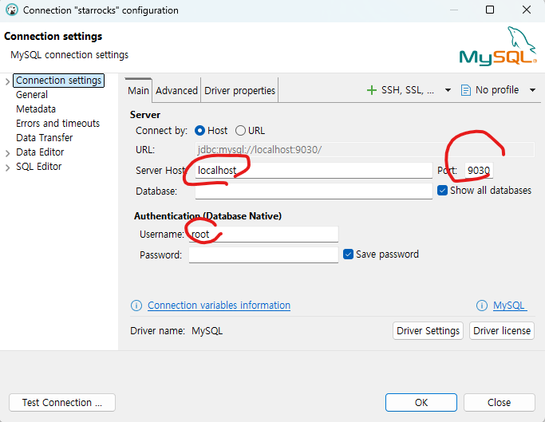

# srt
starrocks 테스트

##  datalake 구축

```

cd datalake
docker-compose up -d

 docker ps -a
CONTAINER ID   IMAGE                         COMMAND                  CREATED          STATUS                    PORTS                                                                                                                                   NAMES
86a099eb4a18   starrocks/be-ubuntu:latest    "/opt/starrocks/be/b…"   39 minutes ago   Up 39 minutes             0.0.0.0:8040->8040/tcp, [::]:8040->8040/tcp, 0.0.0.0:9050->9050/tcp, [::]:9050->9050/tcp                                                starrocks-be
a4ac83d8bee6   apache/kudu:latest            "/kudu-entrypoint.sh…"   39 minutes ago   Up 39 minutes             0.0.0.0:7051->7051/tcp, [::]:7051->7051/tcp, 0.0.0.0:8051->8051/tcp, [::]:8051->8051/tcp                                                kudu-tserver
e0a0a783717d   projectnessie/nessie:latest   "/usr/local/s2i/run"     39 minutes ago   Up 39 minutes             8080/tcp, 8443/tcp, 0.0.0.0:19120->19120/tcp, [::]:19120->19120/tcp                                                                     nessie
060e82c39d6c   starrocks/fe-ubuntu:latest    "/opt/starrocks/fe/b…"   39 minutes ago   Up 39 minutes             0.0.0.0:8030->8030/tcp, [::]:8030->8030/tcp, 0.0.0.0:9020->9020/tcp, [::]:9020->9020/tcp, 0.0.0.0:9030->9030/tcp, [::]:9030->9030/tcp   starrocks-fe
1961862e32e1   apache/spark:3.5.0            "/opt/spark/bin/spar…"   39 minutes ago   Up 39 minutes             0.0.0.0:7077->7077/tcp, [::]:7077->7077/tcp, 0.0.0.0:8080->8080/tcp, [::]:8080->8080/tcp                                                spark
667405dabe39   apache/kudu:latest            "/kudu-entrypoint.sh…"   39 minutes ago   Up 39 minutes             0.0.0.0:7050->7050/tcp, [::]:7050->7050/tcp, 0.0.0.0:8050->8050/tcp, [::]:8050->8050/tcp                                                kudu-master
b186d2a90c61   minio/minio:latest            "/usr/bin/docker-ent…"   39 minutes ago   Up 39 minutes (healthy)   0.0.0.0:9000-9001->9000-9001/tcp, [::]:9000-9001->9000-9001/tcp 

```


## 접속 정보



## 셋업

디비 베어 접속후

```
ALTER SYSTEM ADD BACKEND "starrocks-be:9050";
SHOW BACKENDS;


CREATE DATABASE IF NOT EXISTS herb24;

USE herb24;


CREATE TABLE detection_logs (
    detect_id VARCHAR(50),
    user_id INT,
    herb_name VARCHAR(50),
    confidence DOUBLE,
    latitude DOUBLE,
    longitude DOUBLE,
    device_os VARCHAR(20),
    detect_time DATETIME
)
DISTRIBUTED BY HASH(detect_id) BUCKETS 3
PROPERTIES(
    "replication_num" = "1"
);
```

## 실행
1. dataGenerator.py 실행
2. uploadData_StarrocksStreamLoadApi.py 실행  10만건의 데이터가 starrocks 에 저장됨


## Spark - Starrocks 데이터 적재
```
(venv) oracle@DESKTOP-GLHA97V:~/project/project_f/mvp/starrocks_test/srt/App$ python load_data_with_spark.py 
🚀 1. Spark Session 초기화 및 StarRocks 커넥터 다운로드 중...
26/04/02 23:14:42 WARN Utils: Your hostname, DESKTOP-GLHA97V resolves to a loopback address: 127.0.1.1; using 10.255.255.254 instead (on interface lo)
26/04/02 23:14:42 WARN Utils: Set SPARK_LOCAL_IP if you need to bind to another address
:: loading settings :: url = jar:file:/mnt/f/project/mvp/starrocks_test/srt/venv/lib/python3.10/site-packages/pyspark/jars/ivy-2.5.1.jar!/org/apache/ivy/core/settings/ivysettings.xml
Ivy Default Cache set to: /home/oracle/.ivy2/cache
The jars for the packages stored in: /home/oracle/.ivy2/jars
com.starrocks#starrocks-spark-connector-3.5_2.12 added as a dependency
mysql#mysql-connector-java added as a dependency
:: resolving dependencies :: org.apache.spark#spark-submit-parent-10944287-e501-4842-a501-f0289c9aa580;1.0
        confs: [default]
        found com.starrocks#starrocks-spark-connector-3.5_2.12;1.1.2 in central
mysql#mysql-connector-java;8.0.33 is relocated to com.mysql#mysql-connector-j;8.0.33. Please update your dependencies.
        found mysql#mysql-connector-java;8.0.33 in central
        found com.mysql#mysql-connector-j;8.0.33 in central
        found com.google.protobuf#protobuf-java;3.21.9 in central
downloading https://repo1.maven.org/maven2/com/mysql/mysql-connector-j/8.0.33/mysql-connector-j-8.0.33.jar ...
        [SUCCESSFUL ] com.mysql#mysql-connector-j;8.0.33!mysql-connector-j.jar (129ms)
downloading https://repo1.maven.org/maven2/com/google/protobuf/protobuf-java/3.21.9/protobuf-java-3.21.9.jar ...
        [SUCCESSFUL ] com.google.protobuf#protobuf-java;3.21.9!protobuf-java.jar(bundle) (105ms)
:: resolution report :: resolve 1793ms :: artifacts dl 238ms
        :: modules in use:
        com.google.protobuf#protobuf-java;3.21.9 from central in [default]
        com.mysql#mysql-connector-j;8.0.33 from central in [default]
        com.starrocks#starrocks-spark-connector-3.5_2.12;1.1.2 from central in [default]
        mysql#mysql-connector-java;8.0.33 from central in [default]
        ---------------------------------------------------------------------
        |                  |            modules            ||   artifacts   |
        |       conf       | number| search|dwnlded|evicted|| number|dwnlded|
        ---------------------------------------------------------------------
        |      default     |   4   |   3   |   3   |   0   ||   3   |   2   |
        ---------------------------------------------------------------------
:: retrieving :: org.apache.spark#spark-submit-parent-10944287-e501-4842-a501-f0289c9aa580
        confs: [default]
        2 artifacts copied, 1 already retrieved (4055kB/12ms)
26/04/02 23:14:45 WARN NativeCodeLoader: Unable to load native-hadoop library for your platform... using builtin-java classes where applicable
Setting default log level to "WARN".
To adjust logging level use sc.setLogLevel(newLevel). For SparkR, use setLogLevel(newLevel).
📦 2. CSV 데이터 읽어오기: /mnt/f/project/mvp/starrocks_test/srt/herb24_100k_data.csv
root
 |-- detect_id: string (nullable = true)
 |-- user_id: integer (nullable = true)
 |-- herb_name: string (nullable = true)
 |-- confidence: double (nullable = true)
 |-- latitude: double (nullable = true)
 |-- longitude: double (nullable = true)
 |-- device_os: string (nullable = true)
 |-- detect_time: timestamp (nullable = true)

⚡ 3. StarRocks로 병렬 분산 적재 시작...
✅ Spark를 통한 StarRocks 대용량 적재 완료!
(venv) oracle@DESKTOP-GLHA97V:~/project/project_f/mvp/starrocks_test/srt/App$ 
```


